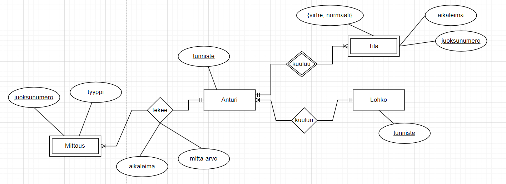
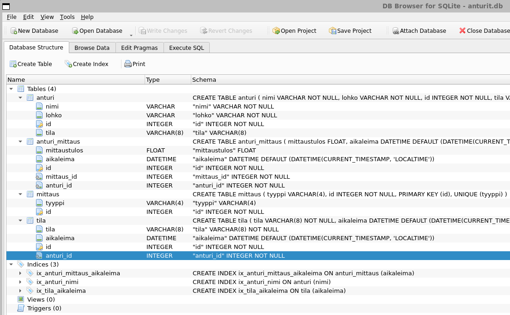

# Raportti - AnturiAPI

## KÄSITEMALLI

Hyödynnetään käsitemallia resurssien päättämisessä. Käsitemalli on tehty sivuston https://app.diagrams.net/ työkalulla (drawio-tiedosto). Työkalu käyttää suhteiden merkinnässä "harakan varvas"-notaatiota. Esimerkiksi 1:N-suhde merkitään siten, että N-pää on "harakan varvas" ja 1-pää on pystyviivalla. Suhteen pakollisuus on yhdellä pystyviivalla. Ei-pakollisille ominaisuuksille merkintä on ympyrä (o). Siten pakollinen N-pää on yksi pystyviiva sekä "harakan varvas" ja pakollinen 1-pää on kaksi pystyviivaa. Voidaan lukea: "Lohkoon **kuuluu** useita antureita, mutta yksi anturi voi **kuulua** vain yhteen lohkoon".



Kuvassa kaikki yhteydet ovat pakollisia (yksi pystyviiva, ennen yhtä pystyviivaa tai "harakan varvasta").

### Yksilötyypit ja suhteet

Yhteen lohkoon voi kuulua useita antureita, mutta anturi voi kuulua vain yhteen lohkoon. Näin ollen Anturi-Lohko-suhde on N:1.  Siispä Anturi-resurssi tulee sisältämään Lohkon tunnisteen (lohko_id). Mielestäni Lohkolle ei tarvita omaa tietokantataulua. Taulussahan olisi vain lohkon tunniste (nimi), koska muita ominaisuuksia lohkolla ei ole käsitemallin perusteella. Tietyn lohkon anturit saadaan kyselemällä Anturi-taulusta kaikki saman lohko-arvon sisältämät rivit.

Jatkokehityksen kannalta olisi varmasti hyvä asettaa mittaukselle tyyppi-ominaisuus. Mittaus-yksilötyypin tyyppi-ominaisuus on esimerkiksi "LÄMPÖTILA". Tällä tarkoitetaan lämpötilan mittausta. Tyyppinä voisi olla myös esimerkiksi "ilman kosteus", jos sitä anturilla mitattaisiin.

### Huomioita käsitemallista

Tila-yksiötyypillä on vain kaksi mahdollista "tilaa" (virhetila ja normaalitila).

Tyyppi ei kuulu mittaustapahtumaan, joten se on Mittaus-yksilötyypin ominaisuus (eikä anturi-mittaus-suhteen ominaisuus).

Tila ja Mittaus ovat heikkoja yksilötyyppejä, joita ei ole olemassa ilman anturia.

Anturin ja Mittauksen yhteydestä on tehtävä oma relaatio (Anturi_Mittaus), koska yhteydellä on ominaisuudet "aikaleima" ja "mitta-arvo".

Lohko-yksilötyypillä on vain tunniste.

Myöhemmin tietokantaan lisättiin vielä tila-ominaisuus (sarake) anturi-tauluun. Se oli yksinkertainen tapa pitää yllä anturin nykyistä tilaa (tila-taulussa on tilojen muutokset).

## RESURSSIT

> Miksi päädyit käyttämääsi resursseihin?

Resurssit on määritelty täysin käsitemallin pohjalta.

> Oletukset:

* antureilla on uniikki nimi

* lohkoilla on uniikki nimi

* anturi lisätään toimivana (ei virhetilassa)

Juoksunumero on tekninen avain tai tunniste, jolla on arvona juokseva numero.

### Anturi

* anturi_juoksunumero*

* anturin nimi

* lohkon nimi

* tila (lisättiin myöhemmin)

### Tila

* tila_juoksunumero*

* anturi_id*

* tila {virhe, normaali}

* aikaleima

### Anturi_Mittaus

* anturi_mittaus_juoksunumero*

* anturi_juoksunumero*

* mittaus_juoksunumero*

* aikaleima

* mitta-arvo

### Mittaus

* mittaus_juoksunumero*

* tyyppi

Tähdellä (*) merkityt "yksilöi" rivin tietokannan taulussa. Aikaleimat tullaan asettamaan tietokannassa.

Uutta anturia ei voi lisätä, jos lohkoa ei ole annettu. Jokainen anturihan kuuluu johonkin lohkoon, ja lisäksi lohkossa on oltava vähintään yksi anturi.

Mittauksen tyyppi on tässä "lämpötila", mutta voisi myös olla jokin muu. Mittaus-malli ei sisällä lohkoa, koska anturi ei sitä tiedä mittaustuloksia lähetettäessä. Tästä tulisi myös toistoa, kun jo Anturi-resurssin tietoihin (malliin) kirjataan lohko.

## CRUD (CREATE, READ, UPDATE, DELETE)

Jaotellaan data- ja hallintanäkymien operaatiot CRUD-toimintoihin CREATE, READ, UPDATE ja DELETE. 

---

### POST (CREATE)

* anturin mittaukset

* lisätään anturi järjestelmään

Kun lisätään uusi anturi, annetaan tieto mihin lohkoon lisättävä anturi kuuluu ja mikä on sen tila (oletettavasti normaalitilassa).

### PUT (UPDATE)

* muuttaa anturin tilaa

* muuttaa lohkoa johon anturi kuuluu

### DELETE (DELETE)

* poistaa yksittäinen mittaustulos

### GET (READ)

* datan kyseleminen

---

### ENDPOINTS

> Mikä ohjasi endpointtien polkusuunnittelua?

Hallinta- ja datanäkymät laitoin erilleen. Polut alkavat joko admin (hallinta) tai anturit (data). Muutoin polut ovat samanlaisia. Esimerkiksi hallinnassa lisätään uusi anturi polussa **/admin/anturit** (POST) ja datanäkymässä luetaan kaikki anturit polusta **/anturit/** (GET).

Paluuarvot, jotka ovat samojen mallien (skeema) mukaiset, yhdistettiin samaan polkuun. Esimerkiksi datanäkymän polku **/anturit** (GET) palauttaa (tunniste, lohko ja tila) joko listan kaikista antureista tai listan tilan perusteella (tunniste, lohko ja tila). Tilan perusteella suodatus tehdään kyselyparametrilla samaisessa polussa.   

Tässä työssä tulosten suodatus tehdään kyselyparametreilla, ja polkuparametreilla saadaan joku tietty resurssi takaisin. Esimerkiksi anturien suodatus tilan mukaan tai mittausten tulosten suodatus ajan tai määrän (skip- ja limit-parametri) suhteen ovat kyselyparametreina annettavia.

Anturin nimi menee sellaisenaan tietokantaan, ja nimi täytyy antaa samassa muodossa tietoja haettaessa.

## TIETOKANTA



Sovellus luo tiedoston "anturit.db". Sitä tarkastelin sqlitebrowser-työkalulla. Käynnistyskomento:

```shell
sqlitebrowser anturit.db
```

Kuvasta nähdään, että tietokantaan on luotu myös muutama indeksi hakujen nopeuttamiseksi. Indeksit on nähtävissä **models.py** tiedostosta, jossa tietokannan pohjana toimivat mallit (SQLModel). Aikaleimat asetetaan tietokannassa paikallisen ajan mukaan.

Huomataan, että anturi-taulussa on myös tila-sarake. Sarake pitää kirjaa anturin nykyisestä tilasta. Tämän sarake lisättiin käsitemallin tekemisen jälkeen.

**Tietokantaan on lisättävä mittaustyyppi hallinnan kautta ennen kuin tietokanta voi ottaa vastaan mittaustyypin mittauksia (esim. 'LÄMPÖTILA').**

---

## TYÖN VALMISTUTTUA

> Mitä opit työtä tehdessäsi?

Ainakin nämä asiat.

* FastAPI, SQLModel ja Pydantic tulivat paljon paremmin tutuksi mitä ennen työn tekemistä

* Koodin lukemiseen kuluu enemmän aikaa kuin kirjoittamiseen (kommentointi tärkeää!)

* Suunnittelu on haastava vaihe!

* Asioiden (mallit, enpointit, funktiot, yms) nimeäminen on vaikeaa...
