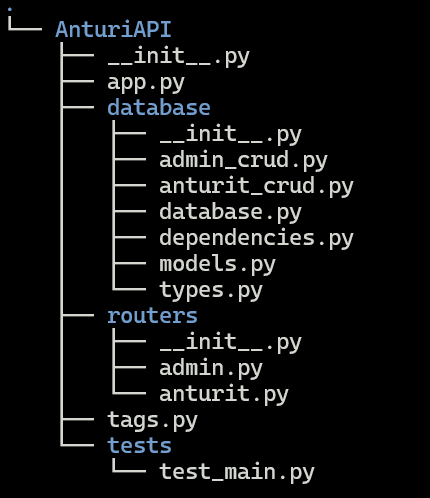

# AnturiAPI

## TYÖKALUT

### Win11

* VSCode 1.88.1
* WSL v0.88.0 (VSCode extension)

### WSL2 (windows subsystem linux)

* Ubuntu 22.04.4 LTS
* git 2.34.1
* Python 3.10.12
* pip 24.0
* sqlitebrowser 3.12.1

## PROJEKTIKANSION RAKENNE



Kaikki seuraavat komennot annetaan projektin juuresta (samalta hakemiston tasolta missä md-tiedostot). Ympäristönä on Ubuntu (WSL2).

## ASENNUS

Virtuaaliympäristön luonti:

```shell
python3 -m venv env
```

Aktivoidaan ympäristö:

```shell
source ./env/bin/activate
```

Asennetaan riippuvuudet:

```shell
pip install -r ./requirements.txt
```

## KÄYNNISTYS

Käynnistys komentoriviltä komennolla:

```shell
uvicorn AnturiAPI.app:app --reload
```

## TESTIT

Testit löytyy tests-kansiosta.

Testien ajaminen (virtuaaliympäristössä).

```shell
python -m pytest -vv
```

Testit luo erillisen tietokannan "test.db". Testin loputtua tietokanta tyhjenee (ennen uutta testiä).

## HUOMIOT

**Mittaustyyppi on lisättävä hallinnan (admin) kautta mittaus-tauluun ennen mittauksen lisäämistä (admin tekee). Muuten tulee virheviesti!**

**Anturin ja lohkon nimen kirjoittaminen on merkkikokoriippuvainen (case-sensitive)**